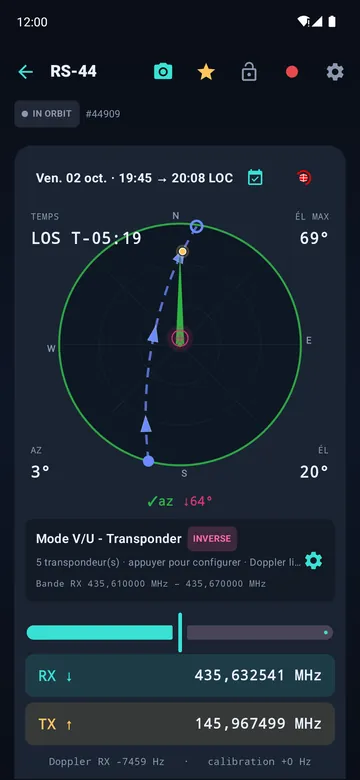
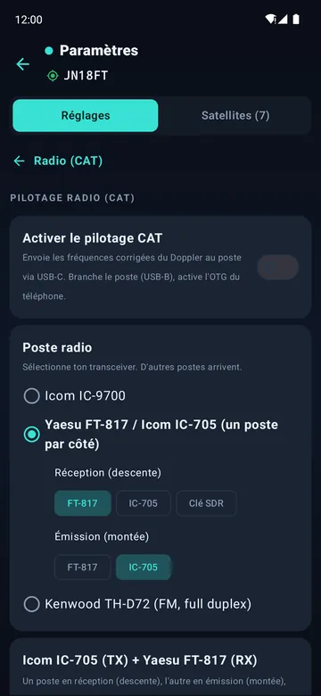
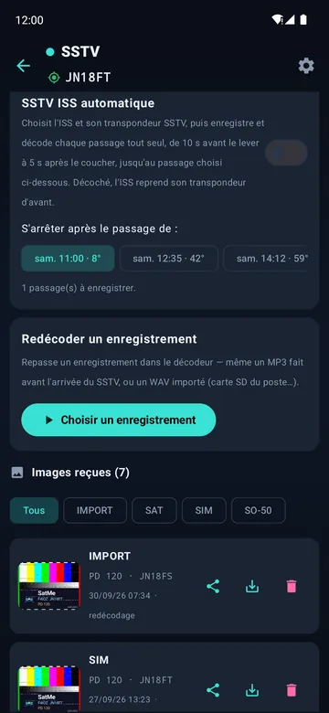
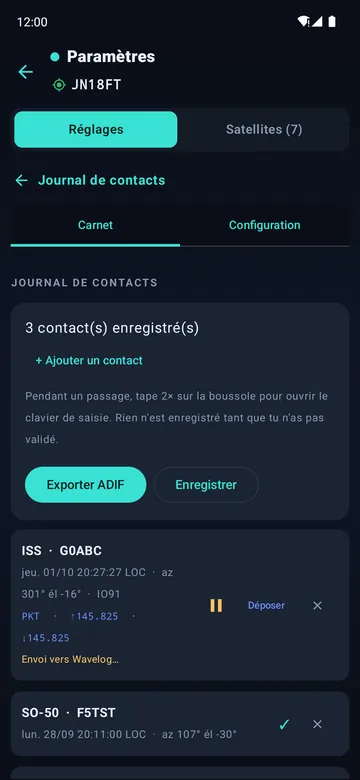
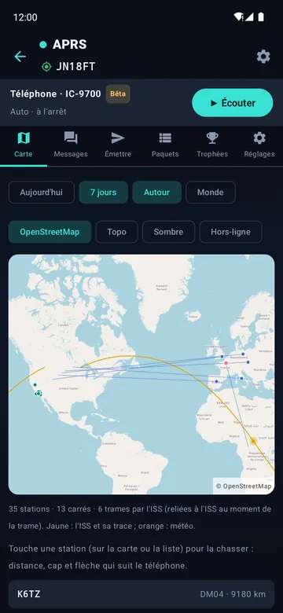
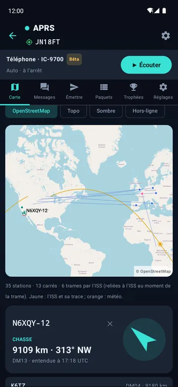
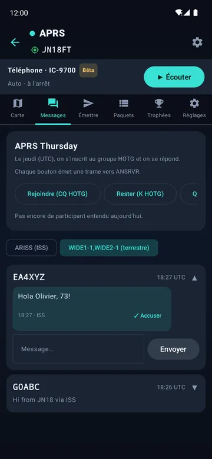
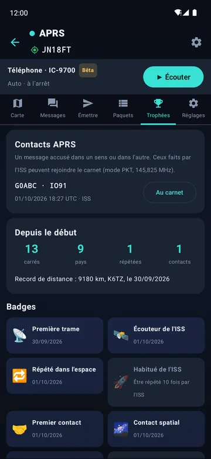

<p align="center"></p>

<h1 align="center">SatMe</h1>

<p align="center">
Poursuite de satellites radioamateurs sur Android — passages, pointage, Doppler, carnet.<br>
<a href="https://play.google.com/store/apps/details?id=fr.f4ioz.satcombo">Google Play</a> ·
<a href="https://github.com/f4ioz/SatMe/wiki/Accueil">Documentation (wiki)</a> ·
<a href="README.md">English</a> ·
<a href="docs/API-v1.fr.md">API</a>
</p>

<p align="center">


</p>
<p align="center">


</p>
<p align="center">




</p>
<p align="center">




</p>

## Nouveautés de la 20.74

- **SSTV automatique** : l'ISS ou un satellite favori et son transpondeur, une case à cocher, et chaque passage est enregistré et décodé tout seul, de 10 s avant le lever à 5 s après le coucher, jusqu'au passage choisi — même écran éteint.
- **APRS (bêta)**, une page complète : carte OpenStreetMap, messages, APRS Thursday, trophées ; sur l'ISS ou en terrestre (144,800 MHz) ; IC-9700, Kenwood TH-D72 en KISS, Yaesu FT3D.
- **Nouveaux postes** : Kenwood TH-D72 en full duplex ; un Yaesu FT-817 ou un Icom IC-705 de chaque côté, ou avec une clé SDR.
- **PDF de la sélection** : choisis combien de prochains passages de chaque satellite sélectionné mettre dans le PDF.
- **ISS à l'heure** : les éléments les plus frais l'emportent d'une source à l'autre (jamais une prévision pour plus tard) ; noms courts et statuts AMSAT quelle que soit la source.

Guide complet dans le **[wiki](https://github.com/f4ioz/SatMe/wiki/Accueil)**.

## Fonctions

### Passages et prévisions
- Prévisions SGP4/SDP4 hors ligne : AOS, LOS, élévation maximale, azimuts, durée, et un tracé polaire pour chaque passage.
- Alerte avant l'AOS, et un passage ajouté à l'agenda du téléphone d'un appui.
- Fiches de passages en PDF à imprimer : coche les passages des satellites, puis choisis combien de prochains passages de chacun imprimer (jusqu'à 20, sur deux semaines).
- Suivi en direct : élévation, azimut, Doppler et compte à rebours, lisibles à bout de bras.
- Globe avec les traces au sol, timeline des prochains passages, et skeds mutuels — les fenêtres où un satellite est visible à la fois chez vous et chez une autre station.
- État AMSAT et SatNOGS de chaque satellite, rapport AMSAT en quelques appuis ; les satellites muets restent hors de la liste. Les satellites portent leur nom court AMSAT (« AO-07 », « ISS ») et leur statut AMSAT, quelle que soit la source des éléments.
- Éléments orbitaux d'AMSAT, de CelesTrak et de SatNOGS (environ 1 700 satellites), ou par un [serveur GP SatMe](https://github.com/f4ioz/SatMe-serveur) ; gardés sur le téléphone pour servir hors ligne. Quand les sources diffèrent, les éléments du moment les plus frais l'emportent.

### Pointage
- Boussole du téléphone avec calibrage guidé, ou module Bluetooth WitMotion fixé sur la flèche d'antenne.
- Rotors : Yaesu GS-232 en série USB, Hamlib rotctld par le réseau. Retournement au zénith, rangement après le passage, et un mât simulé pour regarder le suivi avant de faire tourner le vrai.

### Poste et Doppler
- Correction Doppler en réception et en émission, transpondeurs linéaires (inverseurs ou non) et FM, avec un calibrage mémorisé par satellite.
- CAT : Icom IC-9700 en mode satellite, Kenwood TH-D72 en full duplex avec son pupitre, un Yaesu FT-817 ou un Icom IC-705 de chaque côté (deux FT-817, deux IC-705 ou un de chaque), ou l'un d'eux en émission pendant qu'une clé RTL-SDR reçoit.
- Le poste est réglé avant l'AOS, prêt dès le lever du satellite. Une molette ou un clavier USB peut le piloter, ses touches apprises en les pressant.
- Le ton CTCSS est pris dans le nom du transpondeur (SO-50, ISS…), ou réglé à la main.
- Un banc d'essai dans les réglages CAT : un poste simulé qui refuse ce que le vrai refuse, les trames échangées traduites en clair, et la séquence de début de passage rejouée sans aucune radio branchée.
- QO-100 : le transpondeur géostationnaire à bande étroite avec vos convertisseurs, et l'erreur de chaque oscillateur mesurée sur une référence.

### Carnet
- Clavier d'indicatifs à une main, recherche QRZ.com, nouveau carré et doublon signalés pendant la saisie.
- Wavelog et Cloudlog : contacts envoyés, au besoin tout seuls une minute après la saisie, avec vos profils de station. SatMe apparaît aussi comme une radio dans Wavelog et Cloudlog : satellite, mode et fréquences corrigées du Doppler se remplissent.
- Confirmations LoTW, carte des carrés locator, export ADIF, QSL et fiches d'activation en PDF.

### Enregistrement et décodage
- Chaque passage enregistré en MP3 — micro du téléphone, Bluetooth mains-libres ou carte son USB du poste — avec une annonce vocale au début (satellite, heure UTC, locator) et une copie dans le dossier de votre choix.
- SSTV décodée en direct pendant l'enregistrement (Robot, Martin, Scottie, PD), ou après coup depuis un enregistrement ou un WAV de la carte SD du poste. SSTV automatique : l'ISS ou un satellite favori et son transpondeur choisis, chaque passage enregistré et décodé tout seul jusqu'au passage choisi, écran éteint compris. Une mire SSTV à émettre, avec des évanouissements simulés pour éprouver un décodeur.
- APRS (bêta) : trames AFSK 1200 décodées pendant l'enregistrement — le digipeater de l'ISS sur 145,825 MHz — ou reçues par un poste KISS, et les stations décodées par un Yaesu FT3D. Positions (Mic-E compris), messages, statuts. Émission par l'IC-9700 ou par un poste KISS comme le Kenwood TH-D72 : APRS Thursday (HOTG) prêt, accusés affichés. On travaille sur l'ISS (145,825 MHz, Doppler suivi) ou sur le réseau terrestre (144,800 MHz, WIDE1-1,WIDE2-1) — ou les deux, l'ISS pendant ses passages et le terrestre le reste du temps. Un bouton « Écouter » règle l'IC-9700 par le CAT ; un Kenwood est passé en KISS et réglé par SatMe lui-même. La position émise peut être approximative (décalage fixe de moins de 500 m).
- L'APRS pour le plaisir : quand l'ISS répète ta propre trame, SatMe le fête (bannière, vibration, notification) et dit qui d'autre était sur le passage. Une carte sur fond OpenStreetMap (zoom et déplacement au doigt) avec les stations entendues, la trace de l'ISS, et chaque station reliée à l'endroit où était l'ISS quand on l'a entendue. Les messages en conversations, accusés dans les deux sens, avec les boutons APRS Thursday et les participants du jour. La chasse à une station : distance, cap et flèche qui suit le téléphone. Le bilan du jour en image à partager, les contacts APRS par l'ISS directement au carnet, des records et 14 badges. Les stations météo décodées, et une balise au passage de l'ISS (désactivée par défaut).
- Décodage FT8 / FT4, radiosondes météo, et clé RTL-SDR avec son spectre.

### Partage
- Démonstration en direct : le public suit le passage sur son propre téléphone, en scannant un QR code.
- Écoute déportée depuis un second téléphone sur le même réseau.
- Poste de commande sur PC : une page servie par le téléphone — saisie au clavier, cadran polaire, enregistrement, votre station et les prochains passages — et une [API HTTP](docs/API-v1.fr.md) pour d'autres clients.

Français et anglais. Commandes lisibles par les lecteurs d'écran.

## Matériel pris en charge

| Type | Modèles |
|---|---|
| Postes | Icom IC-9700 · Kenwood TH-D72 (FM, full duplex) · Yaesu FT-817 ou Icom IC-705¹ de chaque côté · FT-817 ou IC-705¹ + clé SDR |
| APRS | Poste KISS en USB : Kenwood TH-D72 (essayé) ; autres TNC KISS sur une ligne série USB¹ · Yaesu FT3D : les stations qu'il décode (positions, sortie WAY.P) |
| SDR | RTL2832U |
| Boussole | WitMotion WT901BLE, WT9011DCL-BT50 |
| Rotors | Yaesu GS-232 · Hamlib rotctld (réseau) |
| Série USB | CP210x, FTDI, PL2303, CH340/341/9102, MCP2200/2221, CDC |
| Divers | Cartes son USB · molette/clavier USB (touches apprises par appui) |

¹ Écrit et testé au banc, pas encore essayé sur le matériel réel.

## Documentation

- **[Wiki SatMe](https://github.com/f4ioz/SatMe/wiki/Accueil)** : le guide complet, pas à pas, avec captures — installation, passages, CAT, enregistrement, SSTV, APRS, carnet, FAQ
- [API du poste de commande v1](docs/API-v1.fr.md) : protocole HTTP pour d'autres clients
- [Serveur GP SatMe](https://github.com/f4ioz/SatMe-serveur) : relais d'éléments orbitaux (OMM/GP) pour SatMe, à installer sur un Raspberry Pi, un serveur Linux ou Proxmox
- [Composants tiers](THIRD-PARTY.fr.md)
- [Politique de confidentialité](docs/privacy-policy.html)

## Compiler

JDK 21, SDK Android 36.

```sh
./gradlew testDebugUnitTest assembleDebug
```

La signature de publication lit `keystore.properties` à la racine (non versionné) : `storeFile`, `storePassword`, `keyAlias`, `keyPassword`.

## Licence

[GPL-2.0-ou-ultérieure](LICENSE). Licences tierces dans [THIRD-PARTY.fr.md](THIRD-PARTY.fr.md).

## Remerciements

- T. S. Kelso — modèles SGP4/SDP4 et CelesTrak (éléments orbitaux)
- John Magliacane KD2BD — PREDICT
- Neoklis Kyriazis 5B4AZ — traduction en C de SGP4/SDP4, reprise par PREDICT
- David Johnson G4DPZ — predict4java (calcul des passages et du Doppler)
- Kārlis Goba — ft8_lib (tables du code correcteur FT8/FT4)
- K9AN, G4WJS et K1JT — protocoles FT8 et FT4 (article QEX)
- Peter Goodhall MM9SQL — Cloudlog
- L'équipe Wavelog — Wavelog, fork de Cloudlog
- IS0GRB — WebSDR QO-100 (référence de fréquence)
- John Morris G4ANB — carrés locateurs Maidenhead
- AMSAT et SatNOGS — état des satellites ; SatNOGS DB — éléments orbitaux
- Bob Bruninga WB4APR (SK) — APRS
- Stephen Smith WA8LMF — CD de test des TNC (essais du décodeur APRS)
- radio-club F6KMX

73 de **F4IOZ**
