<p align="center"></p>

<h1 align="center">SatMe</h1>

<p align="center">
Amateur radio satellite tracking for Android — passes, pointing, Doppler, logging.<br>
<a href="https://play.google.com/store/apps/details?id=fr.f4ioz.satcombo">Google Play</a> ·
<a href="https://github.com/f4ioz/SatMe/wiki">Documentation (wiki)</a> ·
<a href="README.fr.md">Français</a> ·
<a href="docs/API-v1.md">API</a>
</p>

<p align="center">
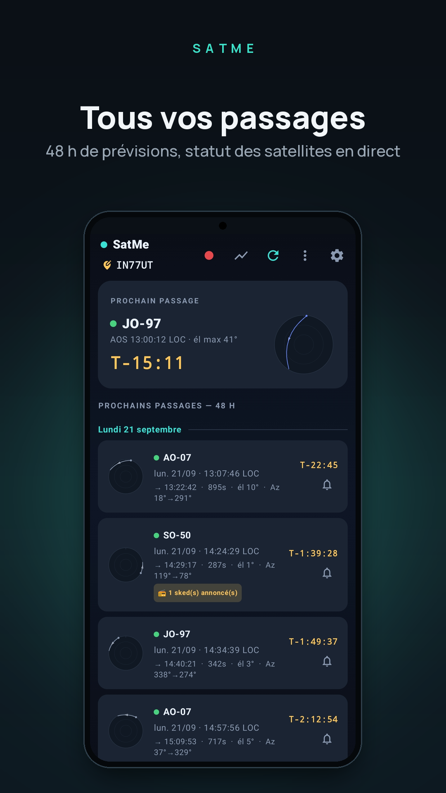
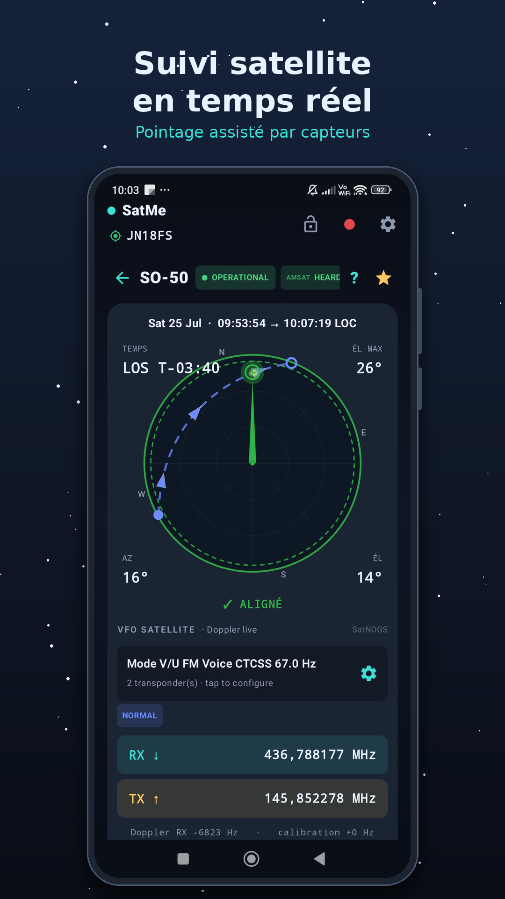
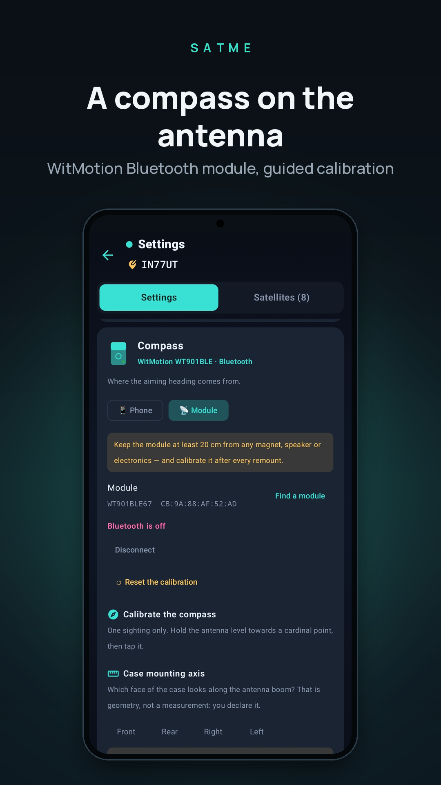
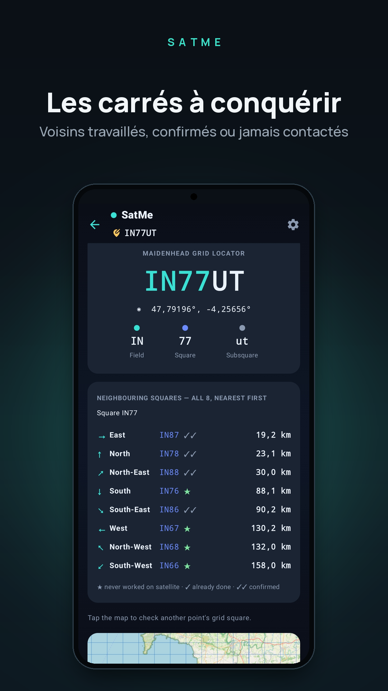
</p>
<p align="center">
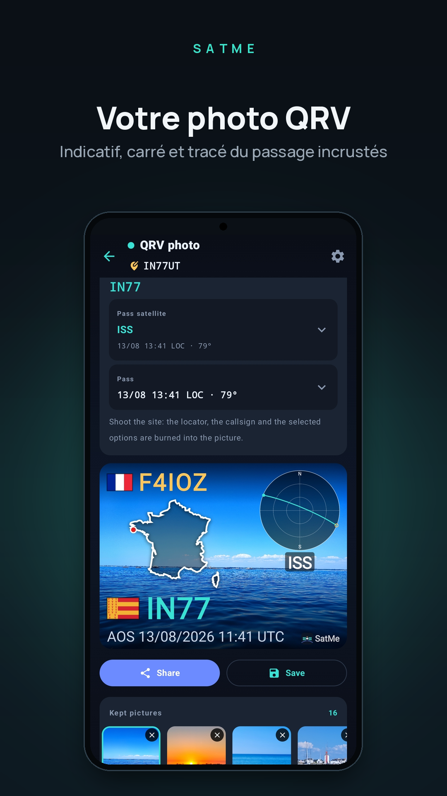
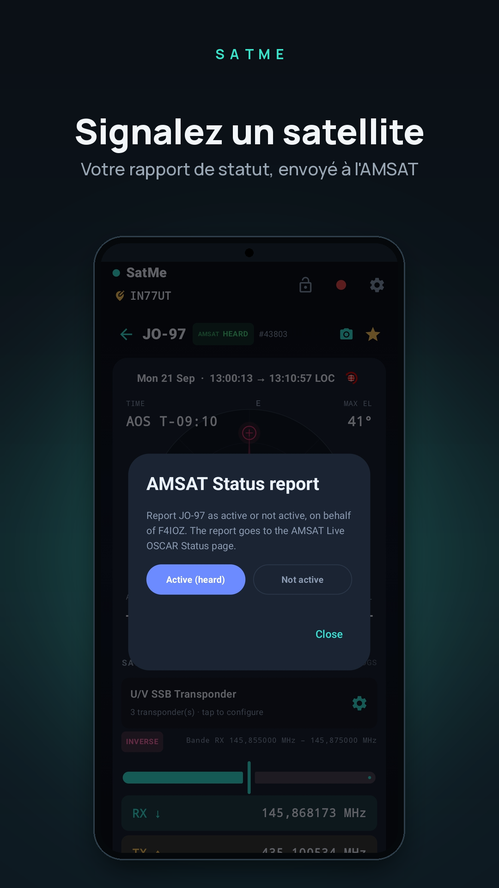
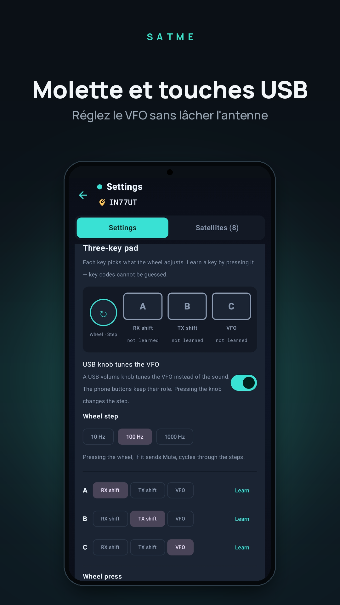
</p>
<p align="center">
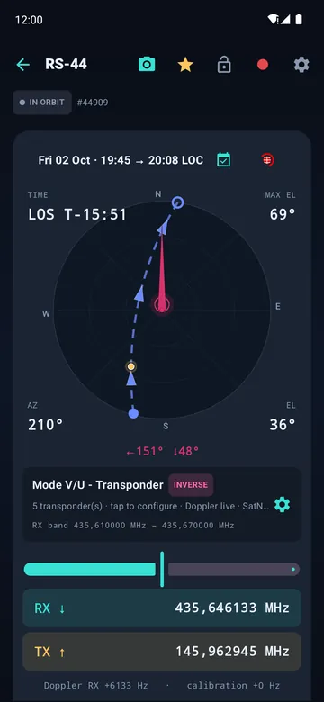
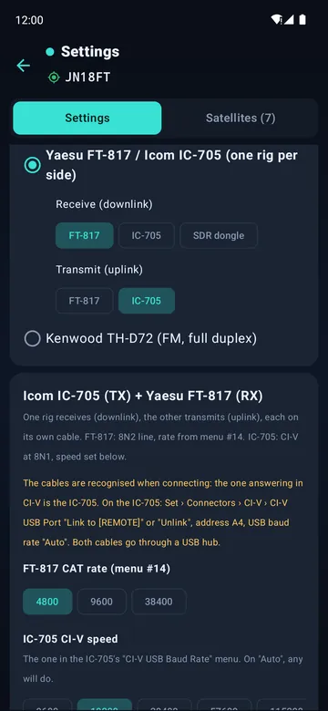
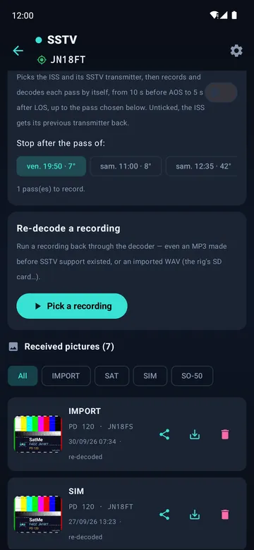
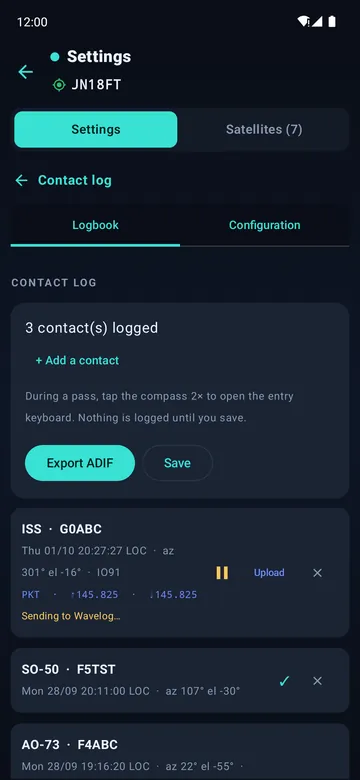
</p>
<p align="center">
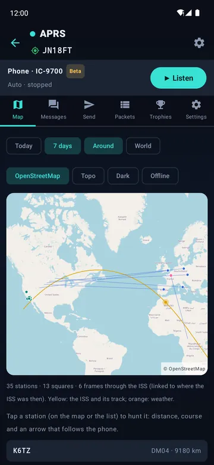
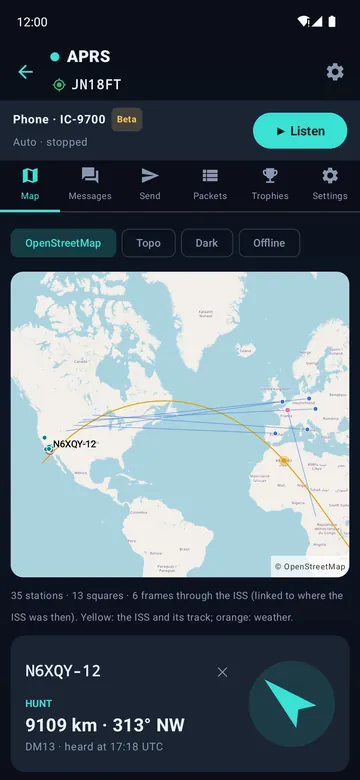
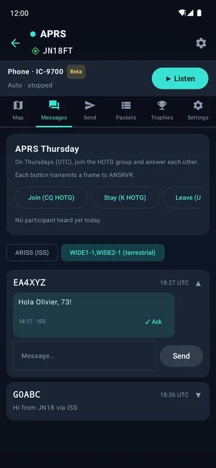
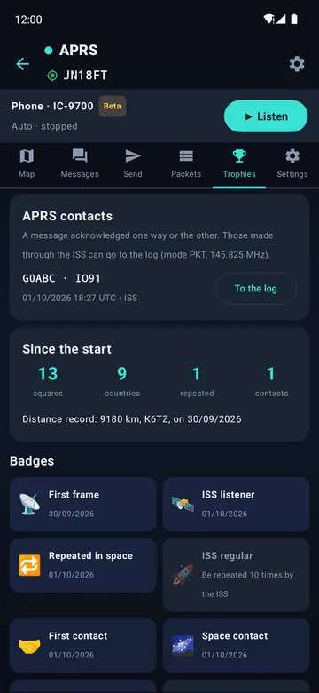
</p>

## What's new in 20.74

- **Automatic ISS SSTV**: tick once, and every ISS pass is recorded and decoded by itself, from 10 s before AOS to 5 s after LOS, up to the pass you choose — even with the screen off.
- **APRS (beta)**, a full page: map over OpenStreetMap, messages, APRS Thursday, trophies; on the ISS or on the terrestrial network (144.800 MHz); IC-9700, Kenwood TH-D72 over KISS, Yaesu FT3D.
- **New rigs**: Kenwood TH-D72 in full duplex; a Yaesu FT-817 or an Icom IC-705 on each side, or with an SDR dongle.
- **ISS on time**: the freshest elements win across sources (never a prediction for later); short AMSAT names and AMSAT status whatever the source.

Full guide in the **[wiki](https://github.com/f4ioz/SatMe/wiki)**.

## Features

### Passes and prediction
- Offline SGP4/SDP4 predictions: AOS, LOS, maximum elevation, azimuths, duration, and a polar plot of every pass.
- Alerts before AOS, and a pass added to the phone's calendar in one tap.
- Live tracking: elevation, azimuth, Doppler and countdown, on a screen readable at arm's length.
- Globe with ground tracks, timeline of the coming passes, and mutual skeds — the windows when a satellite is visible both from you and from another station.
- AMSAT and SatNOGS status for each satellite, AMSAT report in a few taps; silent satellites kept out of the list. Satellites carry their short AMSAT name ("AO-07", "ISS") and their AMSAT status whatever the element source.
- Orbital elements from AMSAT, CelesTrak and SatNOGS (about 1,700 satellites), or through a [SatMe GP server](https://github.com/f4ioz/SatMe-serveur); kept on the phone for use offline. When sources disagree, the freshest elements for now win.

### Pointing
- Phone compass with guided calibration, or a WitMotion Bluetooth module fixed on the antenna boom.
- Rotators: Yaesu GS-232 over USB serial, Hamlib rotctld over the network. Flip over the zenith, park after the pass, and a simulated mast to watch the tracking before moving the real one.

### Rig control and Doppler
- RX and TX Doppler correction, linear transponders (inverting or not) and FM, with a calibration kept per satellite.
- CAT: Icom IC-9700 in satellite mode, Kenwood TH-D72 in full duplex with its own panel, a Yaesu FT-817 or Icom IC-705 on each side (two FT-817, two IC-705, or one of each), or one of them transmitting while an RTL-SDR dongle receives.
- The rig is tuned before AOS, ready as the satellite rises. A USB knob or keypad can drive it, its keys learned by pressing them.
- The CTCSS tone is picked from the transponder's name (SO-50, ISS…), or set by hand.
- A test bench in the CAT settings: a simulated rig that refuses what the real one refuses, the frames exchanged decoded in plain words, and the pass-start sequence replayed with no radio plugged in.
- QO-100: the geostationary narrowband transponder with your converters, and the error of each oscillator measured against a reference.

### Logging
- One-handed callsign keypad, QRZ.com lookup, new grid square and duplicate flagged while typing.
- Wavelog and Cloudlog: contacts uploaded, optionally by themselves a minute after entry, with your station profiles. SatMe also shows up as a radio in Wavelog and Cloudlog: satellite, mode and Doppler-corrected frequencies are filled in.
- LoTW confirmations, grid squares map, ADIF export, PDF QSL cards and activation sheets.

### Recording and decoding
- Every pass recorded to MP3 — phone microphone, Bluetooth hands-free or the rig's USB sound card — with a spoken header (satellite, UTC time, locator) and a copy in the folder of your choice.
- SSTV decoded live while recording (Robot, Martin, Scottie, PD), or later from a recording or a WAV from the rig's SD card. Automatic ISS SSTV: the ISS and its SSTV transmitter picked, each pass recorded and decoded by itself up to the pass you choose, screen off included. An SSTV test card to send, with simulated fading to check a decoder.
- APRS (beta): AFSK 1200 frames decoded while recording — the ISS digipeater on 145.825 MHz — or received through a KISS radio, and the stations a Yaesu FT3D decodes. Positions (Mic-E included), messages, status. Transmit through the IC-9700 or a KISS radio such as the Kenwood TH-D72: APRS Thursday (HOTG) ready, acks shown. Works on the ISS (145.825 MHz, Doppler tracked) or on the terrestrial network (144.800 MHz, WIDE1-1,WIDE2-1) — or both, the ISS during its passes and terrestrial the rest of the time. One "Listen" button sets the IC-9700 up over CAT; a Kenwood is switched to KISS and tuned by SatMe itself. Your position can go out approximate (a fixed offset under 500 m).
- APRS for fun: when the ISS repeats your own frame, SatMe cheers (banner, buzz, notification) and tells who else was on that pass. A map over OpenStreetMap tiles (pinch and drag) with the stations heard, the ISS track, and each station linked to where the ISS was when it was heard. Messages as conversations, acked both ways, with one-tap APRS Thursday buttons and today's participants. Hunt a station with distance, course and an arrow that follows the phone. The day's tally as a picture to share, APRS contacts through the ISS straight into the log, records and 14 badges. Weather stations decoded, and an optional beacon as the ISS passes (off by default).
- FT8 / FT4 decoding, weather radiosondes, and an RTL-SDR dongle with its spectrum.

### Sharing
- Live demonstration: the audience follows the pass on their own phones, joining with a QR code.
- Remote listening from a second phone on the same network.
- PC control desk: a web page served by the phone — keyboard entry, polar dial, recording, your station and the coming passes — and an [HTTP API](docs/API-v1.md) for other clients.

French and English. Controls readable by screen readers.

## Supported hardware

| Type | Models |
|---|---|
| Radios | Icom IC-9700 · Kenwood TH-D72 (FM, full duplex) · Yaesu FT-817 or Icom IC-705¹ on each side · FT-817 or IC-705¹ + SDR dongle |
| APRS | KISS radio over USB: Kenwood TH-D72 (tried); other KISS TNCs on a USB serial line¹ · Yaesu FT3D: stations it decodes (positions, WAY.P output) |
| SDR | RTL2832U |
| Compass | WitMotion WT901BLE, WT9011DCL-BT50 |
| Rotators | Yaesu GS-232 · Hamlib rotctld (network) |
| USB serial | CP210x, FTDI, PL2303, CH340/341/9102, MCP2200/2221, CDC |
| Other | USB sound cards · USB knob/keypad (keys learned by pressing) |

¹ Built and bench-tested, not yet tried on the real hardware.

## Documentation

- **[SatMe wiki](https://github.com/f4ioz/SatMe/wiki)**: the full guide, step by step, with screenshots — installation, passes, CAT, recording, SSTV, APRS, logbook, FAQ
- [Control desk API v1](docs/API-v1.md): HTTP protocol for third-party clients
- [SatMe GP server](https://github.com/f4ioz/SatMe-serveur): relays orbital elements (OMM/GP) to SatMe, to install on a Raspberry Pi, a Linux server or Proxmox
- [Third-party components](THIRD-PARTY.md)
- [Privacy policy](docs/privacy-policy.html)

## Build

JDK 21, Android SDK 36.

```sh
./gradlew testDebugUnitTest assembleDebug
```

Release signing reads `keystore.properties` at the root (not committed): `storeFile`, `storePassword`, `keyAlias`, `keyPassword`.

## License

[GPL-2.0-or-later](LICENSE). Third-party licenses in [THIRD-PARTY.md](THIRD-PARTY.md).

## Credits

- T. S. Kelso — SGP4/SDP4 models and CelesTrak (orbital elements)
- John Magliacane KD2BD — PREDICT
- Neoklis Kyriazis 5B4AZ — C translation of SGP4/SDP4, used by PREDICT
- David Johnson G4DPZ — predict4java (pass and Doppler computation)
- Kārlis Goba — ft8_lib (FT8/FT4 error-correcting code tables)
- K9AN, G4WJS and K1JT — FT8 and FT4 protocols (QEX article)
- Peter Goodhall MM9SQL — Cloudlog
- The Wavelog team — Wavelog, a Cloudlog fork
- IS0GRB — QO-100 WebSDR (frequency reference)
- John Morris G4ANB — Maidenhead locator squares
- AMSAT and SatNOGS — satellite status; SatNOGS DB — orbital elements
- Bob Bruninga WB4APR (SK) — APRS
- Stephen Smith WA8LMF — TNC test CD (APRS decoder testing)
- F6KMX radio club

73 de **F4IOZ**
