<p align="center"></p>

<h1 align="center">SatMe</h1>

<p align="center">
Amateur radio satellite tracking for Android — passes, pointing, Doppler, logging.<br>
<a href="https://play.google.com/store/apps/details?id=fr.f4ioz.satcombo">Google Play</a> ·
<a href="https://github.com/f4ioz/SatMe/wiki/Why-SatMe">Why SatMe?</a> ·
<a href="https://github.com/f4ioz/SatMe/wiki">Documentation (wiki)</a> ·
<a href="README.fr.md">Français</a> ·
<a href="docs/API-v1.md">API</a>
</p>

### A real pass, as SatMe kept it

The ISS on 4 October: four school pictures in Robot 36, decoded as they arrived, each in its place on the trajectory — then RS-44 replayed with its S-meter and the frequency the rig was on, and the picture SatMe makes to share the moment.

<p align="center">
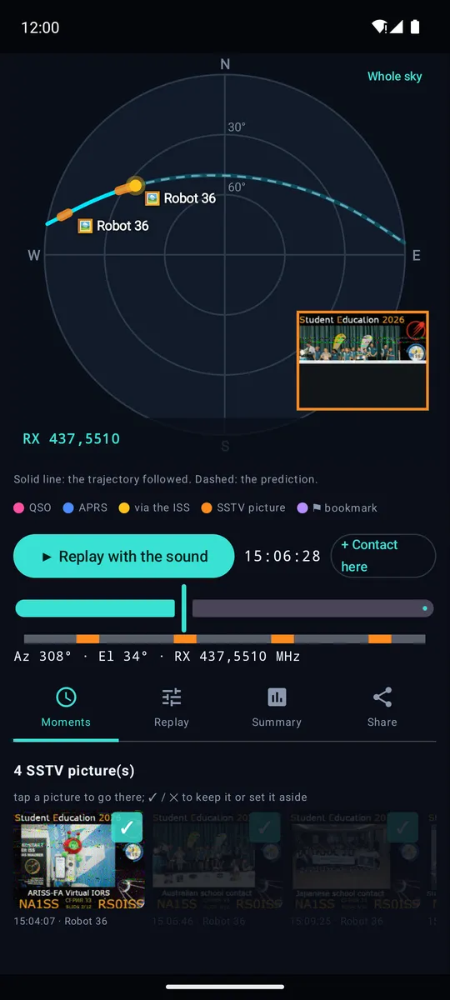
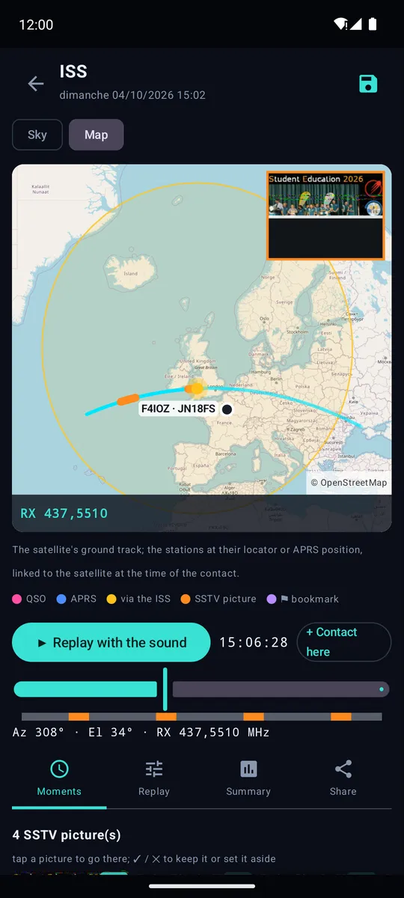
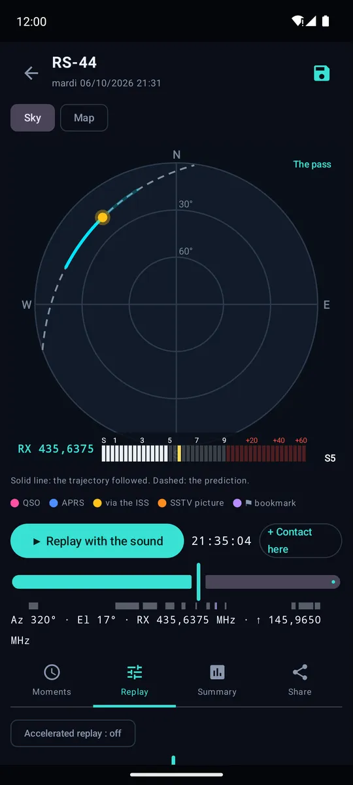
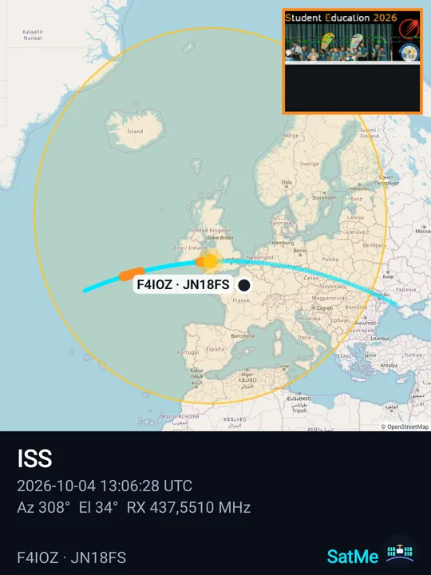
</p>

### On the PC too

The phone serves pages to the PC's browser (USB cable or Wi-Fi, nothing to install): the pass journal replayed large on a map with its sound, and the SSTV sheet laid out with the mouse.

<p align="center">
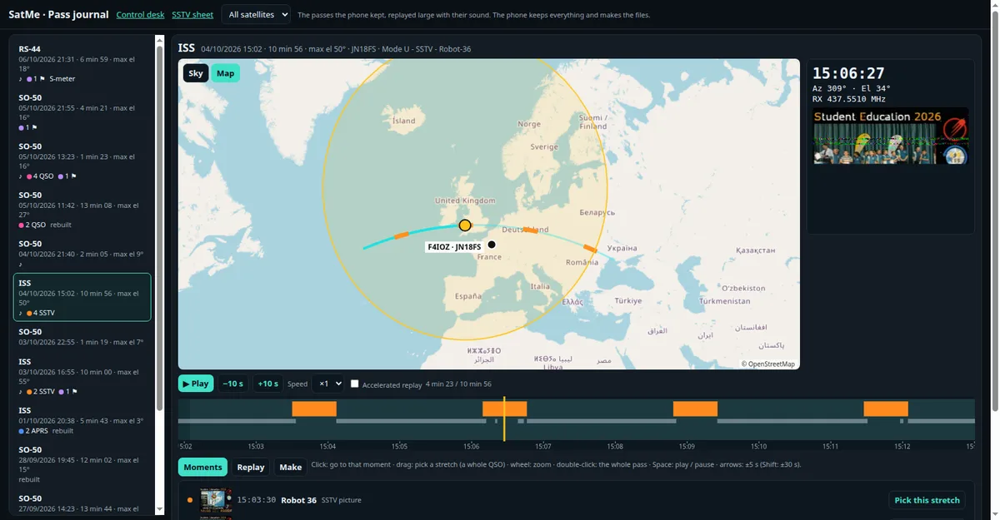
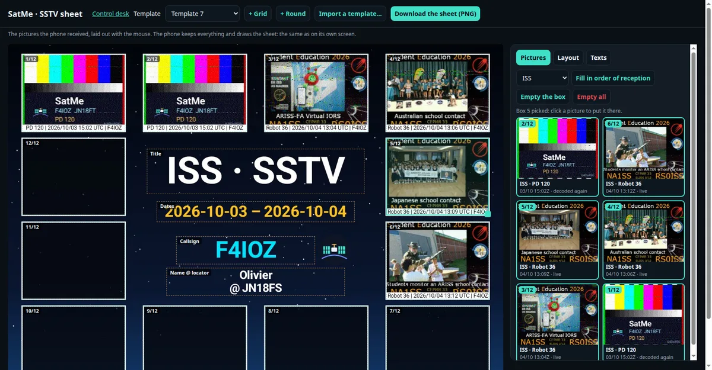
</p>

<p align="center"><a href="https://play.google.com/store/apps/details?id=fr.f4ioz.satcombo"><b>▶ Get SatMe on Google Play</b></a> — free, no account, no ads</p>

<p align="center">


</p>
<p align="center">


</p>
<p align="center">


</p>
<p align="center">


</p>
<p align="center">
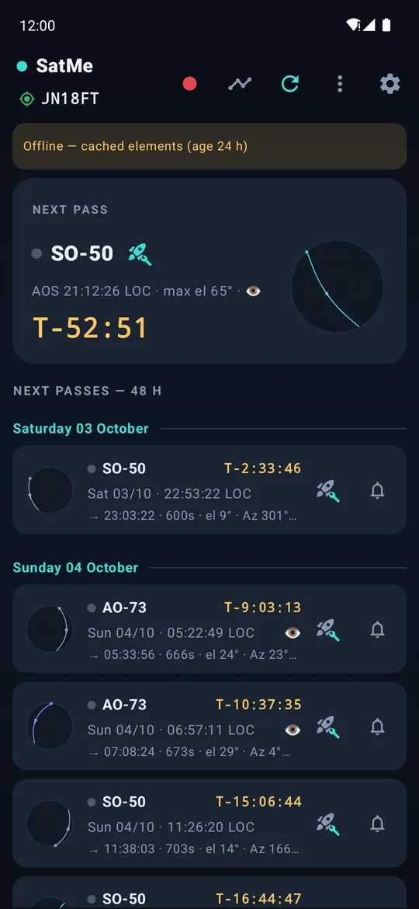
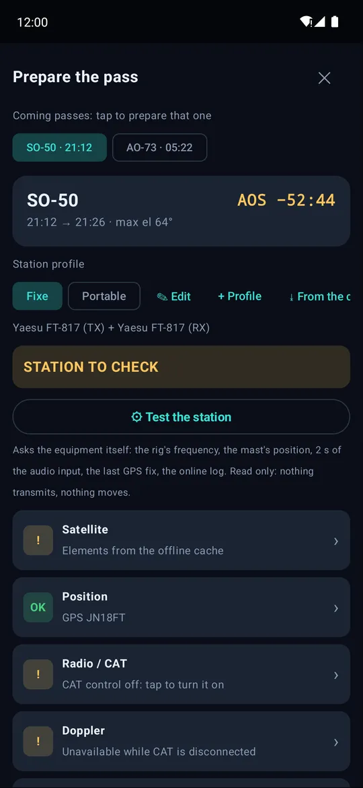
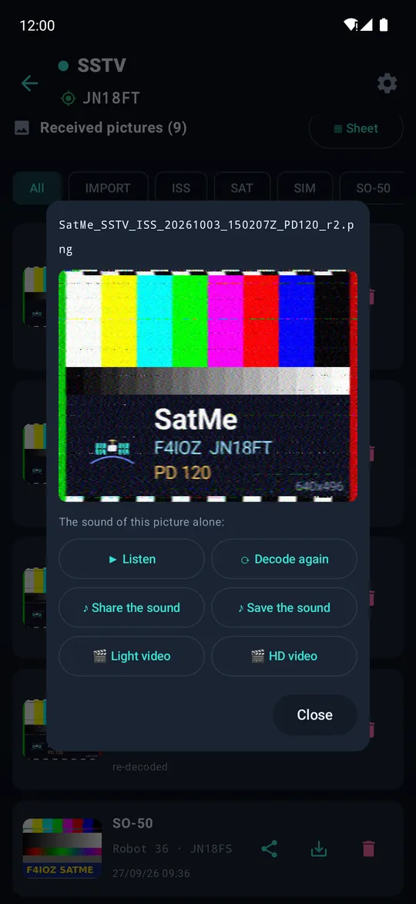
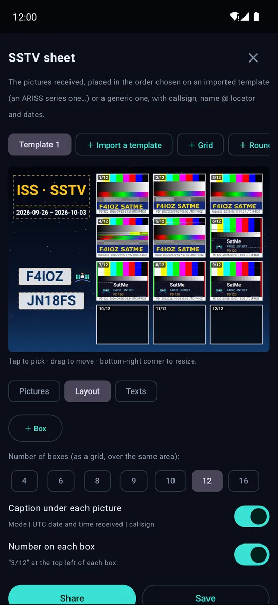
</p>
<p align="center">
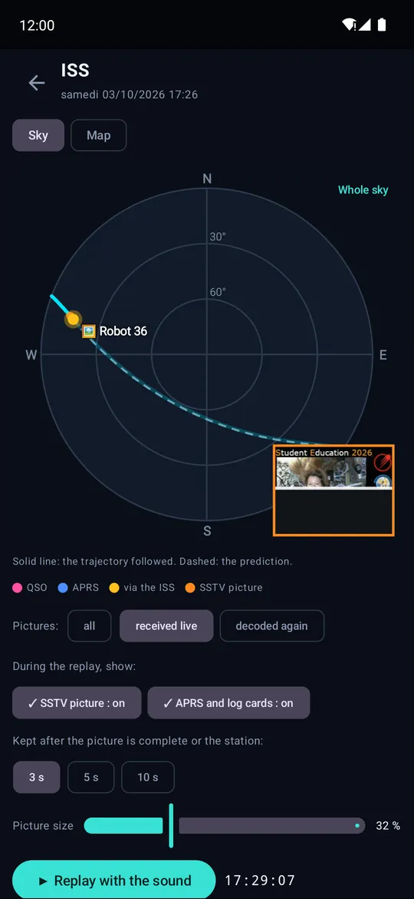
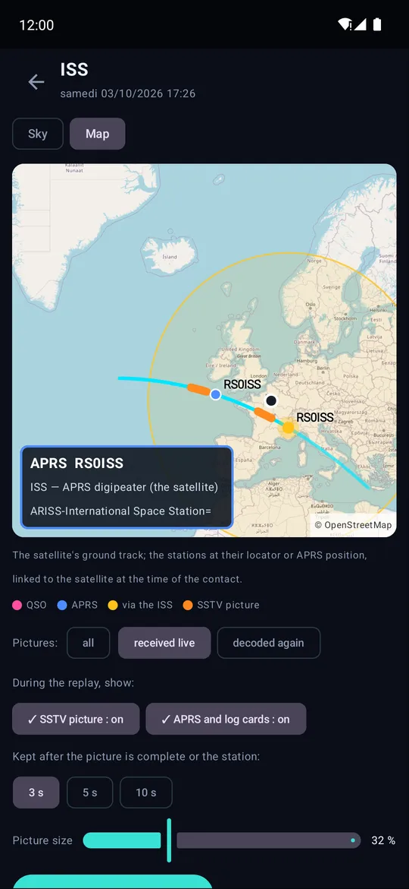
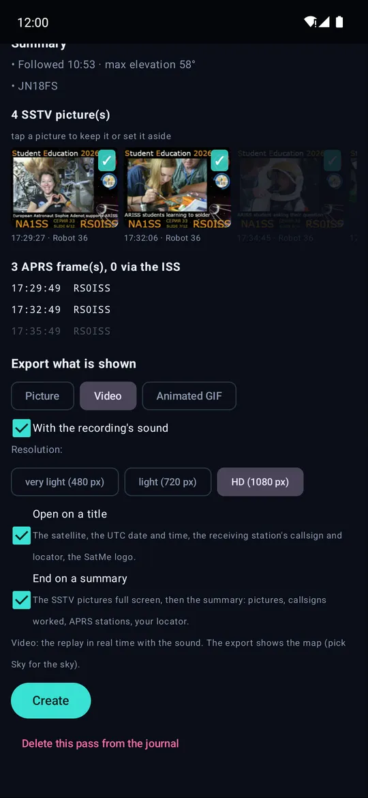
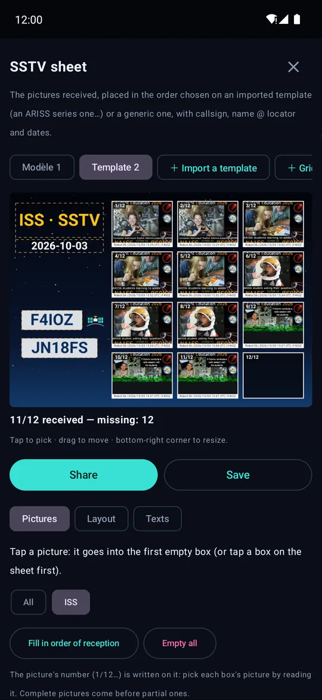
</p>

## Coming in the next version

- **METEOR weather pictures (LRPT)**, beta: METEOR-M2-3 and M2-4 decoded on the phone from an RTL-SDR dongle and a 137 MHz antenna — colour by day and infrared, north up, a preview while the pass comes in; started by hand or by itself before each pass; a raw I/Q WAV recording decoded too. On the satellite's page, one button: **Receive the pictures**. Checked on the recording of a real pass, not yet live.
- **Rotator: fewer relay clicks** — one axis at a time, the mast a little ahead of the satellite, at most one command every 6 s.

<p align="center">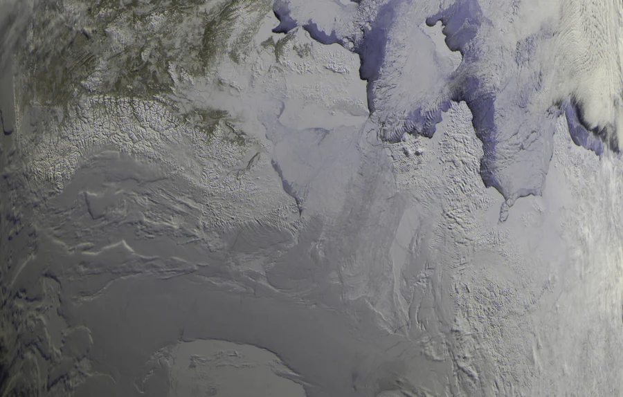</p>

## What's new in 20.81

- **Rotator: a pass over the end stop is planned** — the antennas go round the far side of the zenith, or tilt over the top with 180° of elevation, instead of turning back at the stop; a full turn only when worth it, never during an expected SSTV picture nor while transmitting. A dial with the stop, the dead zone, the cable and the planned path; the path also drawn in white on the satellite's compass.
- **Kenwood TS-2000** in SAT mode: Doppler on both VFOs, mode of each side, CTCSS, S-meter.

### And in 20.80

- **The pass journal on the PC**: the passes replayed large with their sound, on the sky or an OpenStreetMap map (footprint, your station, the stations worked or heard), the S-meter and the SSTV picture arriving, a timeline to click, drag (a whole QSO) and zoom, accelerated replay; the phone makes the sound, the picture, the video, the GIF or the pass file, and the PC downloads it.
- **The SSTV sheet on the PC**: the template large, boxes and texts moved with the mouse, pictures dragged into the boxes, a template imported from the PC, the sheet downloaded at full resolution.
- A tighter control desk page; the three pages linked, under one code.

### And in 20.79

- **Pass journal**, much richer: bookmarks during the pass, the IC-9700's S-meter and the RX frequency on the replay, an accelerated replay that slows down where something was heard, a contact entered from any moment of the pass, several recordings for one pass, a summary with a map of every station worked and heard.
- **Passes found from Wavelog / Cloudlog** by date, satellite and station square — a station on a grid line ("JN06,JN16") included.
- **Share** a whole pass or a moment (a whole QSO) as a picture, a video with its sound, a GIF or a sound; or the **pass in one file**, with its contacts if you wish, for another SatMe station to replay.

Every version in the [wiki](https://github.com/f4ioz/SatMe/wiki/Release-notes). Full guide in the **[wiki](https://github.com/f4ioz/SatMe/wiki)**.

## Features

### Passes and prediction
- Offline SGP4/SDP4 predictions: AOS, LOS, maximum elevation, azimuths, duration, and a polar plot of every pass.
- Alerts before AOS, and a pass added to the phone's calendar in one tap.
- Printable PDF pass sheets: tick the satellites' passes, then choose how many coming passes of each to print (up to 20, two weeks ahead).
- Live tracking: elevation, azimuth, Doppler and countdown, on a screen readable at arm's length.
- Pass journal: every pass followed kept on the phone (real trajectory, rig frequencies, antennas, recording), on the sky or an OpenStreetMap map with the footprint; contacts, APRS stations and SSTV pictures in place; replayed with its sound, with cards for the stations; exported as a picture, a video, a GIF or a sound. Bookmarks, the IC-9700's S-meter, an accelerated replay, contacts entered from the replay. Past passes found again from the log, the pictures, the recordings and Wavelog / Cloudlog; a pass given to another station in one file.
- Prepare the pass: from the icon on any pass, nine lights check the station against your profiles (Home, Portable…, each with its rigs, compass and audio source), each leading to what fixes it. A read-only station test asks the equipment itself; with CAT connected, the rig goes to the satellite prepared. Simultaneous passes are marked.
- Globe with ground tracks, timeline of the coming passes, and mutual skeds — the windows when a satellite is visible both from you and from another station.
- AMSAT and SatNOGS status for each satellite, AMSAT report in a few taps; silent satellites kept out of the list. Satellites carry their short AMSAT name ("AO-07", "ISS") and their AMSAT status whatever the element source.
- Orbital elements from AMSAT, CelesTrak and SatNOGS (about 1,700 satellites), or through a [SatMe GP server](https://github.com/f4ioz/SatMe-serveur); kept on the phone for use offline. When sources disagree, the freshest elements for now win.

### Pointing
- Phone compass with guided calibration, or a WitMotion Bluetooth module fixed on the antenna boom.
- Rotators: Yaesu GS-232 over USB serial, Hamlib rotctld over the network. A pass over the end stop planned before it (far side of the zenith, over the top, a turn only when worth it), the path shown on the compass. Flip over the zenith, park after the pass, and simulated antennas to watch the tracking before moving the real ones.

### Rig control and Doppler
- RX and TX Doppler correction, linear transponders (inverting or not) and FM, with a calibration kept per satellite.
- CAT: Icom IC-9700 in satellite mode, Kenwood TS-2000 in SAT mode, Kenwood TH-D72 in full duplex with its own panel, a Yaesu FT-817 or Icom IC-705 on each side (two FT-817, two IC-705, or one of each), or one of them transmitting while an RTL-SDR dongle receives.
- The rig is tuned before AOS, ready as the satellite rises. A USB knob or keypad can drive it, its keys learned by pressing them.
- The CTCSS tone is picked from the transponder's name (SO-50, ISS…), or set by hand.
- A test bench in the CAT settings: a simulated rig that refuses what the real one refuses, the frames exchanged decoded in plain words, and the pass-start sequence replayed with no radio plugged in.
- QO-100: the geostationary narrowband transponder with your converters, and the error of each oscillator measured against a reference.

### Logging
- One-handed callsign keypad, QRZ.com lookup, new grid square and duplicate flagged while typing.
- Wavelog and Cloudlog: contacts uploaded, optionally by themselves a minute after entry, with your station profiles. SatMe also shows up as a radio in Wavelog and Cloudlog: satellite, mode and Doppler-corrected frequencies are filled in.
- LoTW confirmations, grid squares map, ADIF export, PDF QSL cards and activation sheets.

### Recording and decoding
- Every pass recorded to MP3 — phone microphone, Bluetooth hands-free or the rig's USB sound card — with a spoken header (satellite, UTC time, locator) and a copy in the folder of your choice.
- SSTV decoded live while recording (Robot, Martin, Scottie, PD), or later from a recording or a WAV from the rig's SD card. Automatic SSTV: the ISS or a favourite satellite and its transmitter picked, each pass recorded and decoded by itself up to the pass you choose, screen off included. An SSTV test card to send, with simulated fading to check a decoder.
- Every pass recorded by itself while the rig is under CAT (option), 5 s before AOS to 5 s after LOS, the audio input checked when arming.
- Each SSTV picture keeps its own sound: listen, decode it again alone, share or save it; a video of the picture arriving with its sound, light or HD; pictures cleaned of lines lost in noise, exported with or without a caption; decoding again keeps when and where it was received. An SSTV sheet puts the pictures of a series, in the order you choose, on an imported template (ARISS…) or a SatMe background, with callsign, logo, name @ locator and dates.
- APRS (beta): AFSK 1200 frames decoded while recording — the ISS digipeater on 145.825 MHz — or received through a KISS radio, and the stations a Yaesu FT3D decodes. Positions (Mic-E included), messages, status. Transmit through the IC-9700 or a KISS radio such as the Kenwood TH-D72: APRS Thursday (HOTG) ready, acks shown. Works on the ISS (145.825 MHz, Doppler tracked) or on the terrestrial network (144.800 MHz, WIDE1-1,WIDE2-1) — or both, the ISS during its passes and terrestrial the rest of the time. One "Listen" button sets the IC-9700 up over CAT; a Kenwood is switched to KISS and tuned by SatMe itself. Your position can go out approximate (a fixed offset under 500 m).
- APRS for fun: when the ISS repeats your own frame, SatMe cheers (banner, buzz, notification) and tells who else was on that pass. A map over OpenStreetMap tiles (pinch and drag) with the stations heard, the ISS track, and each station linked to where the ISS was when it was heard. Messages as conversations, acked both ways, with one-tap APRS Thursday buttons and today's participants. Hunt a station with distance, course and an arrow that follows the phone. The day's tally as a picture to share, APRS contacts through the ISS straight into the log, records and 14 badges. Weather stations decoded, and an optional beacon as the ISS passes (off by default).
- METEOR-M2-3 / M2-4 weather pictures (LRPT, beta) from an RTL-SDR dongle: colour and infrared, live, by themselves on each pass, or from a raw I/Q recording.
- FT8 / FT4 decoding, weather radiosondes, and an RTL-SDR dongle with its spectrum.

### Sharing
- Live demonstration: the audience follows the pass on their own phones, joining with a QR code.
- Remote listening from a second phone on the same network.
- Pictures, videos, sounds, sheets and cards: shared, or saved on the phone.
- PC control desk: web pages served by the phone, by USB cable or Wi-Fi — keyboard entry, polar dial, recording, your station and the coming passes; the pass journal replayed large (map, S-meter, timeline, accelerated replay, videos made by the phone); the SSTV sheet laid out with the mouse — and an [HTTP API](docs/API-v1.md) for other clients.

French and English. Controls readable by screen readers.

## Supported hardware

| Type | Models |
|---|---|
| Radios | Icom IC-9700 · Kenwood TS-2000 (SAT mode; RigExpert Tiny tried) · Kenwood TH-D72 (FM, full duplex) · Yaesu FT-817 or Icom IC-705¹ on each side · FT-817 or IC-705¹ + SDR dongle |
| APRS | KISS radio over USB: Kenwood TH-D72 (tried); other KISS TNCs on a USB serial line¹ · Yaesu FT3D: stations it decodes (positions, WAY.P output) |
| SDR | RTL2832U (voice, SSTV, METEOR pictures with a 137 MHz antenna) |
| Compass | WitMotion WT901BLE, WT9011DCL-BT50 |
| Rotators | Yaesu GS-232 · Hamlib rotctld (network) |
| USB serial | CP210x, FTDI, PL2303, CH340/341/9102, MCP2200/2221, CDC |
| Other | USB sound cards · USB knob/keypad (keys learned by pressing) |

¹ Built and bench-tested, not yet tried on the real hardware.

### Wiring

The phone has a single USB-C port. A powered hub behind it carries everything: rigs, sound card, SDR dongle, rotator interface, knob. Through its USB-C PD input it can also charge the phone during the pass. An RTL-SDR dongle alone draws about 300 mA, which is why the hub must be powered. The PC control desk then works over Wi-Fi.

<p align="center">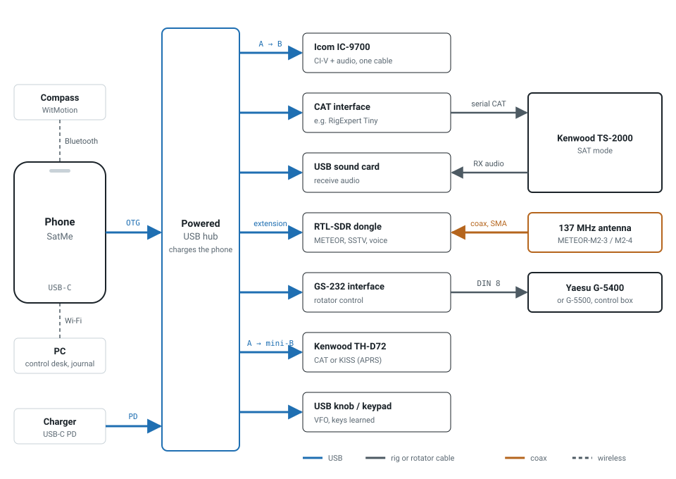</p>

## Documentation

- **[SatMe wiki](https://github.com/f4ioz/SatMe/wiki)**: the full guide, step by step, with screenshots — installation, passes, CAT, recording, SSTV, APRS, logbook, FAQ
- [Control desk API v1](docs/API-v1.md): HTTP protocol for third-party clients
- [SatMe GP server](https://github.com/f4ioz/SatMe-serveur): relays orbital elements (OMM/GP) to SatMe, to install on a Raspberry Pi, a Linux server or Proxmox
- [Third-party components](THIRD-PARTY.md)
- [Privacy policy](docs/privacy-policy.html)

## Build

JDK 21, Android SDK 36.

```sh
./gradlew testDebugUnitTest assembleDebug
```

Release signing reads `keystore.properties` at the root (not committed): `storeFile`, `storePassword`, `keyAlias`, `keyPassword`.

## License

[GPL-2.0-or-later](LICENSE). Third-party licenses in [THIRD-PARTY.md](THIRD-PARTY.md).

## Credits

- T. S. Kelso — SGP4/SDP4 models and CelesTrak (orbital elements)
- John Magliacane KD2BD — PREDICT
- Neoklis Kyriazis 5B4AZ — C translation of SGP4/SDP4, used by PREDICT
- David Johnson G4DPZ — predict4java (pass and Doppler computation)
- Kārlis Goba — ft8_lib (FT8/FT4 error-correcting code tables)
- K9AN, G4WJS and K1JT — FT8 and FT4 protocols (QEX article)
- Peter Goodhall MM9SQL — Cloudlog
- The Wavelog team — Wavelog, a Cloudlog fork
- IS0GRB — QO-100 WebSDR (frequency reference)
- John Morris G4ANB — Maidenhead locator squares
- AMSAT and SatNOGS — satellite status; SatNOGS DB — orbital elements
- Bob Bruninga WB4APR (SK) — APRS
- Stephen Smith WA8LMF — TNC test CD (APRS decoder testing)
- F6KMX radio club

73 de **F4IOZ**
